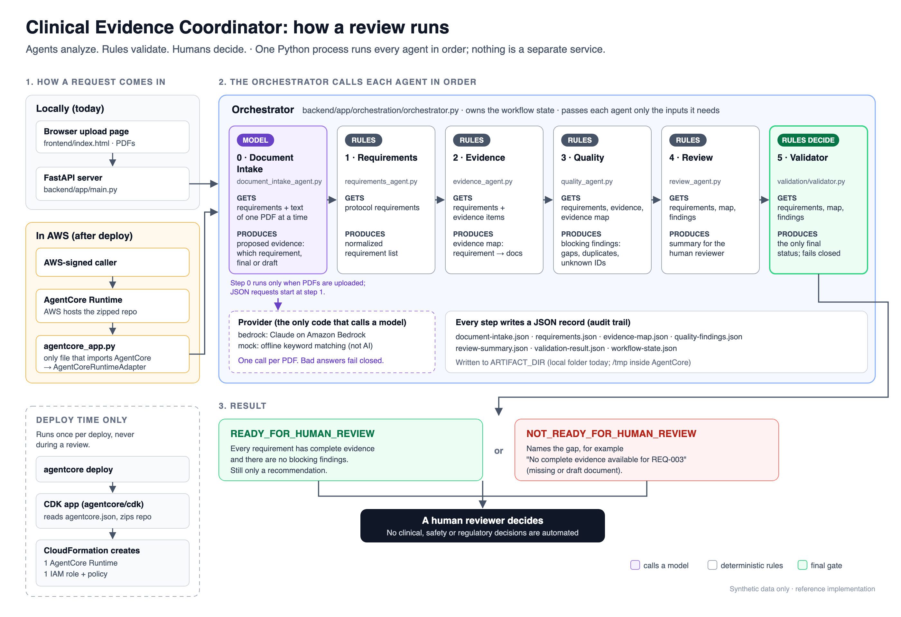
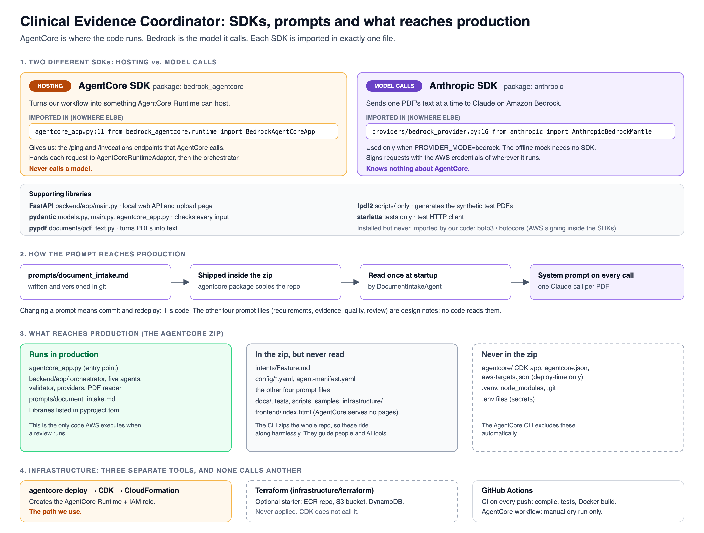

# Clinical Evidence Coordinator — AgentCore Edition

A working starter repo for learning the full path:

**Intent → code → tests → GitHub Actions → Amazon Bedrock AgentCore Runtime → Bedrock → evidence → deterministic validation → human review**

The application reviews **synthetic clinical-study evidence packages** for structural completeness, consistency, and traceability.

> **Agents analyze. Rules validate. Humans decide.**

This repo deliberately separates **domain logic** from **cloud runtime plumbing** so the clinical workflow can later map to other clouds without rewriting the core.

## What is already implemented

- Explicit shared workflow state
- Orchestrator + four bounded workers (plain rules, no LLM)
  - Requirements Agent
  - Evidence Agent
  - Quality Agent
  - Review Agent
- Document Intake Agent: reads uploaded PDFs and proposes which requirement each one is evidence for, and whether it is final (Claude on Bedrock, or an offline keyword mock)
- Upload page (`frontend/index.html`) served by the local API
- Structured artifacts between stages
- Deterministic fail-closed validator: the model proposes, the rules decide
- Synthetic study packages (JSON) and synthetic study documents (PDF), grouped into test scenarios
- FastAPI local API
- AgentCore Runtime entry point (`agentcore_app.py`) and CLI-generated AgentCore project config (`agentcore/`)
- Unit/integration tests
- Dockerfile
- GitHub Actions CI and a manual AgentCore dry-run workflow
- Cloud-neutral platform interfaces
- Starter Terraform for optional S3 / DynamoDB / ECR resources

## Current status

| Stage | Status |
|---|---|
| Local workflow, upload page, tests | Working |
| AgentCore package (`agentcore package`) | Builds; the zip runs correctly on Linux ARM64 / Python 3.12 |
| Claude on Bedrock (`PROVIDER_MODE=bedrock`) | Code complete; not yet run, because Claude model access is not enabled on the AWS account |
| AWS deployment (`agentcore deploy`) | Not deployed; the dry run needs CloudFormation permissions for the deploying IAM identity |
| Documents through AgentCore | Not yet; the AgentCore entry point accepts JSON study packages only |

## Architecture





Editable sources: `images/how-it-runs.svg`, `images/sdks-and-production.svg`.

```text
                    DOMAIN LAYER
┌─────────────────────────────────────────────────────────────┐
│ Intent.md                                                   │
│ Study package                                               │
│                                                             │
│        ┌──────────────┐                                     │
│        │ Orchestrator │                                     │
│        └──────┬───────┘                                     │
│               │                                             │
│   ┌───────────┼───────────┬──────────────┐                  │
│   ▼           ▼           ▼              ▼                  │
│ Requirements Evidence    Quality        Review              │
│   Agent       Agent       Agent          Agent               │
│   └───────────┴───────────┴──────────────┘                  │
│               │                                             │
│         Explicit State                                      │
│               │                                             │
│      Deterministic Validator                                │
│               │                                             │
│       Human Review Required                                 │
└─────────────────────────────────────────────────────────────┘
                         │
                         │ adapter boundary
                         ▼
                    PLATFORM LAYER
┌─────────────────────────────────────────────────────────────┐
│ Local mock runtime                                          │
│ Amazon Bedrock AgentCore Runtime                            │
│ Bedrock model provider                                      │
│ Future: Azure / Google adapters                             │
└─────────────────────────────────────────────────────────────┘
```

## Run locally

Requires Python 3.12+.

```bash
python -m venv .venv
source .venv/bin/activate
pip install -r requirements.txt
python -m compileall backend && pytest -q
uvicorn backend.app.main:app --reload
```

Open http://127.0.0.1:8000, choose every PDF in one folder under `samples/scenarios/`, and click **Review package**:

| Folder | Expected result |
|---|---|
| `1-ready/` | Ready for human review (the parking memo matches nothing) |
| `2-missing-adverse-event/` | Not ready: REQ-003 has no evidence |
| `3-draft-adverse-event/` | Not ready: the adverse event record is a draft |

By default documents are matched by an offline keyword mock (labelled "not AI" on the page). To use Claude on Bedrock:

```bash
AWS_PROFILE=<profile with Bedrock access> PROVIDER_MODE=bedrock uvicorn backend.app.main:app
```

`BEDROCK_MODEL_ID` defaults to `anthropic.claude-opus-5`. The account needs Claude model access enabled in the Bedrock console.

The original JSON API still works:

```bash
curl -X POST http://localhost:8000/api/review -H "Content-Type: application/json" --data @samples/study-package-complete.json
curl -X POST http://localhost:8000/api/review -H "Content-Type: application/json" --data @samples/study-package-missing-evidence.json
```

## AgentCore path

`agentcore_app.py` is the only module that imports the AgentCore SDK; it calls the existing orchestrator through `AgentCoreRuntimeAdapter`. The project config in `agentcore/` was generated with the AgentCore CLI (`npm install -g @aws/agentcore`).

```bash
python agentcore_app.py          # local runtime: /ping and /invocations on 127.0.0.1:8080
agentcore validate
agentcore package                # build the CodeZip
agentcore deploy --dry-run       # plan: one Runtime + one IAM role/policy
```

Before the first local deploy, copy `agentcore/aws-targets.example.json` to `agentcore/aws-targets.json` and fill in your account ID. That file is gitignored; the GitHub deploy workflow writes it from the `AWS_ACCOUNT_ID` and `AWS_REGION` repository variables.

Background reading, in order:

1. `CLAUDE.md`
2. `intents/Feature.md`
3. `docs/AGENTCORE_DEPLOYMENT.md`
4. `docs/PLATFORM_ARCHITECTURE.md`
5. `docs/BUILD_SEQUENCE.md`
6. `docs/AI_ANALYSIS.md`: current assessment of this design as a template for many agents

## Learning goal

Be able to explain:

- what belongs in the domain repo,
- what belongs in the shared agent platform,
- what AgentCore manages,
- what remains your responsibility,
- how state moves,
- how tools are governed,
- how validation fails closed,
- how agent #2 avoids copying the whole repo,
- and where AWS-specific dependencies are contained.
